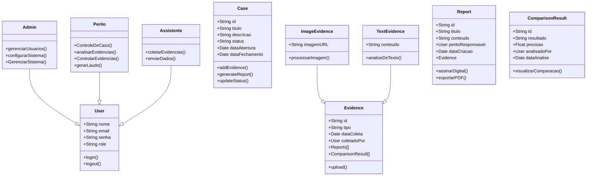

# Backend-Siop ♨︎

## **Descrição**  
Este projeto é uma API para gerenciamento de casos forenses, evidências e laudos periciais. Ele implementa autenticação JWT e controle de permissões para diferentes papéis de usuários (**Admin, Perito, Assistente**).  

## **Tecnologias Utilizadas**  
- **Node.js** + **Express.js**  
- **MongoDB** + **Mongoose**  
- **JWT** para autenticação  
- **Dotenv** para gerenciamento de variáveis de ambiente  
- **Cors** controle de acessos
- **Bcryptjs** hash de senhas

---

## **Instalação e Configuração**  

### **1. Clone o repositório**  
```sh
git clone https://github.com/Happjoi/backend-SIOP
cd backend-SIOP
```

### **2. Instale as dependências**  
```sh
npm i
```

### **3. Configure as variáveis de ambiente**  
Crie um arquivo `.env` na raiz do projeto e defina as variáveis:  
```
PORT=3000
MONGO_URI=string_conexão
```

### **4. Routes**
Rotas RESTful para Controle Total

---

### ✓ **Rotas RESTful para Controle Total**

#### ↪︎ **Casos (`/api/cases`)**
| Método | Rota                     | Ação                      |
|--------|--------------------------|---------------------------|
| GET    | `/api/cases`             | Listar todos os casos     |
| GET    | `/api/cases/:id`         | Buscar caso específico    |
| POST   | `/api/cases`             | Criar novo caso           |
| PUT    | `/api/cases/:id`         | Atualizar caso            |
| DELETE | `/api/cases/:id`         | Remover caso              |

---

#### ↪︎ **Usuários (`/api/users`)**
| Método | Rota                     | Ação                          |
|--------|--------------------------|-------------------------------|
| GET    | `/api/users`             | Listar todos os usuários      |
| GET    | `/api/users/:id`         | Buscar usuário específico     |
| POST   | `/api/users`             | Criar novo usuário            |
| PUT    | `/api/users/:id`         | Atualizar dados do usuário    |
| DELETE | `/api/users/:id`         | Remover usuário               |

---

#### ↪︎ **Evidências (`/api/evidences`)**
| Método | Rota                         | Ação                              |
|--------|------------------------------|-----------------------------------|
| GET    | `/api/evidences`             | Listar todas as evidências        |
| GET    | `/api/evidences/:id`         | Buscar evidência específica       |
| POST   | `/api/evidences`             | Cadastrar nova evidência          |
| PUT    | `/api/evidences/:id`         | Atualizar evidência               |
| DELETE | `/api/evidences/:id`         | Remover evidência                 |

---

#### ↪︎ **Relatórios (`/api/reports`)**
| Método | Rota                      | Ação                          |
|--------|---------------------------|-------------------------------|
| GET    | `/api/reports`            | Listar todos os relatórios    |
| GET    | `/api/reports/:id`        | Ver relatório específico      |
| POST   | `/api/reports`            | Criar novo relatório          |
| PUT    | `/api/reports/:id`        | Atualizar relatório           |
| DELETE | `/api/reports/:id`        | Remover relatório             |

---

### **4.1 Routes Authorization**
Este sistema utiliza JWT (JSON Web Token) para autenticação e controle de acesso baseado em papéis (roles).

- `/api/auth/` *Login* e *Logout*

### 5. Diagrama do Banco de Dados

---

### 6. Próxima **Atualização**

Estamos trabalhando em uma nova atualização do sistema que trará **novas funcionalidades importantes** para tornar a plataforma ainda mais completa e eficiente.

Entre as principais melhorias previstas, destacamos:

- 6.1 **Upload de Imagens:** será possível anexar imagens diretamente nos casos e evidências, facilitando a documentação visual do material periciado.  
- 6.2 **Visualização de Arquivos:** as imagens enviadas poderão ser visualizadas dentro da aplicação como pdf, otimizando o processo de análise.

Essas funcionalidades estarão disponíveis em breve e farão parte de um conjunto de atualizações voltadas à **melhoria da experiência do usuário e do fluxo de trabalho pericial**.

---

